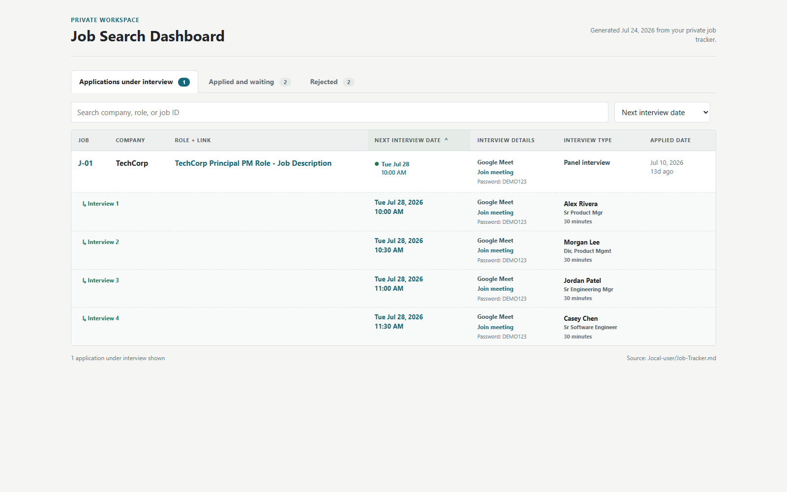
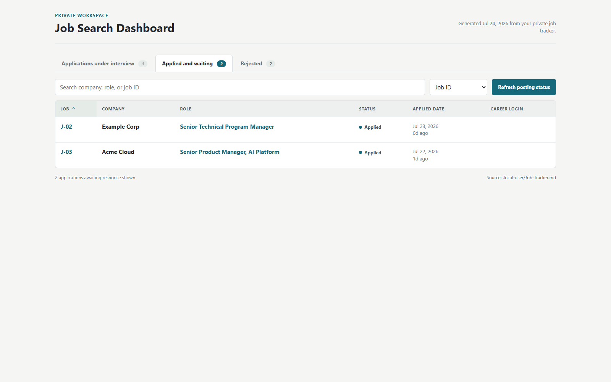
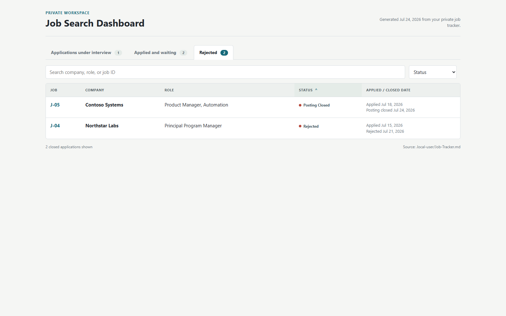

# Local Job Dashboard

The local dashboard turns the private Markdown job tracker into a browser view without sending application data to a hosted service.

It provides three tabs:

1. **Applications under interview** — the default view, including interview dates, prep links, meeting details, and multi-interviewer schedules when those details exist in the private packet.
2. **Applied and waiting** — submitted applications that do not yet have an interview.
3. **Rejected** — explicit rejections and applications whose official posting was definitively confirmed closed.

The Markdown tracker remains the source of truth. `.local-user/dashboard.html` is generated output and stays private because the entire `.local-user/` directory is gitignored.

## Preview

These screenshots use fictional sample applications. No personal job-search data is included.

### Applications under interview



### Applied and waiting



### Rejected and posting closed



## Setup

Install the repository dependencies and Playwright's browser:

```bash
npm install
npx playwright install chromium
```

Initialize the private workspace by following [`local-user-template/README.md`](../local-user-template/README.md). Then start the local-only server:

```bash
node scripts/run-job-dashboard.js
```

Open `http://127.0.0.1:4173/`.

The included VS Code task can start the server when the workspace opens. VS Code may require one-time approval through **Tasks: Manage Automatic Tasks**.

## Tracker contract

Use the header in [`local-user-template/Job-Tracker.md`](../local-user-template/Job-Tracker.md):

```markdown
| ID | Company | Role | Status | Last Action | Last Updated | Applied Date | Rubric Score | Interview Stage |
```

Keep one row per job ID. Job IDs must use the `J-01` pattern. Preserve the original Applied Date when later events change the status.

Each application packet should live under `.local-user/_Active/J-XX-Company-Role/` and contain `01-Job-Description.md`. Label the official employer or ATS posting URL explicitly:

```markdown
**Official Job URL:** https://careers.example.com/jobs/123
```

A LinkedIn URL may be retained as a discovery source, but the checker does not guess from arbitrary links. A packet without `Official Job URL:` or `Employer/ATS URL:` is skipped and reported for correction.

The dashboard reads optional interview details from packet files, including `60-Interview-Prep.md` and structured interviewer schedule tables. Missing details remain visibly unspecified rather than being inferred.

## Generate or serve

Generate the static private HTML:

```bash
node scripts/generate-job-dashboard.js
```

Serve it with local actions enabled:

```bash
node scripts/run-job-dashboard.js
```

Serving is required for opening packet files or folders and for the posting-status refresh button. The server binds only to `127.0.0.1`, validates action requests as local, and restricts file and folder actions to existing paths inside `.local-user/`.

## Refresh applied postings

In **Applied and waiting**, select **Refresh posting status**. The checker uses Node.js and Playwright locally; it does not call OpenAI, Claude, or another model API.

Refresh is deliberately split into two steps:

1. The checker scans the labelled official URLs and proposes possible closures. No files or tracker rows change.
2. Review the evidence and official posting link, select the specific applications to close, and confirm **Archive selected**. Unselected proposals remain active.

You can preview the same check without changing files:

```bash
npm run refresh:postings:dry-run
```

A posting is proposed as closed only when the employer or ATS supplies corroborated evidence:

- HTTP 404 or 410
- Explicit closure text near the start of the posting
- Explicit closure text plus the target job title no longer appearing in the posting content

The checker prefers the page's main content region rather than scanning navigation, footers, and unrelated page text. A closure phrase inside similar-job recommendations or generic help text is not sufficient by itself.

The following are inconclusive and never change application state:

- Authentication or login walls
- Bot challenges or CAPTCHAs
- HTTP 401, 403, 429, or 5xx responses
- DNS failures, connection failures, or timeouts
- Unexplained redirects
- Pages with too little readable content to verify

Only after the user selects and confirms a proposed closure, the checker:

1. Changes Status to `Closed - posting closed`.
2. Records `Official posting confirmed unavailable on YYYY-MM-DD; no rejection email received` in Last Action.
3. Preserves Applied Date and changes Last Updated to the check date.
4. Sets Interview Stage to `Closed`.
5. Moves the packet from `.local-user/_Active/` to `.local-user/_Archive/`.
6. Regenerates the dashboard so the application appears under Rejected as **Posting Closed**.

This classification means the posting is unavailable. It does not claim that the employer sent an explicit rejection.

## Optional career-portal links

Workday career portal links are derived from packet URLs when possible. Put any manual overrides in the private `.local-user/dashboard-config.json` file:

```json
{
  "careerPortalOverrides": {
    "Example Corp": "https://careers.example.com/candidate-home"
  }
}
```

Company keys must exactly match the tracker. Do not add personal employer lists or portal URLs to `scripts/generate-job-dashboard.js`.

## Verification

Run the deterministic checker tests after changing closure classification or tracker mutation logic:

```bash
npm run test:posting-refresh
```
